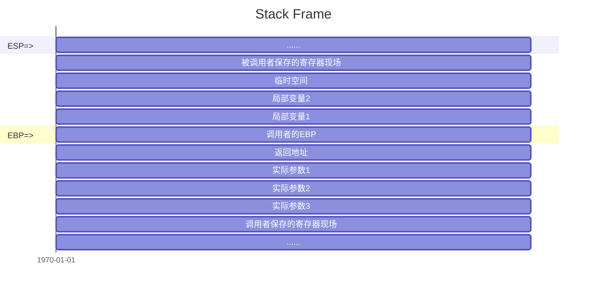
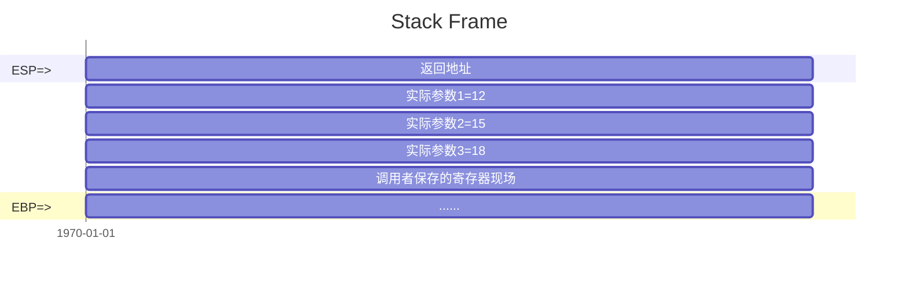

## 栈帧与函数调用约定  

> [!cite]- References  
> [CppGuide/articles/C++必知必会的知识点/你一定要搞明白的C函数调用方式与栈原理.md at master · balloonwj/CppGuide · GitHub](https://github.com/balloonwj/CppGuide/blob/master/articles/C%2B%2B%E5%BF%85%E7%9F%A5%E5%BF%85%E4%BC%9A%E7%9A%84%E7%9F%A5%E8%AF%86%E7%82%B9/%E4%BD%A0%E4%B8%80%E5%AE%9A%E8%A6%81%E6%90%9E%E6%98%8E%E7%99%BD%E7%9A%84C%E5%87%BD%E6%95%B0%E8%B0%83%E7%94%A8%E6%96%B9%E5%BC%8F%E4%B8%8E%E6%A0%88%E5%8E%9F%E7%90%86.md)

### 栈帧  
在二进制码/汇编层级没有函数的概念，需要通过栈来实现参数传递  
C++ 标准没有定义栈帧的实现方式，各编译器、处理器、操作系统可能采用不同的建立栈帧的方式  


如上图所示，ESP 指示栈顶  
EBP 为基准指针，从调用者传到被调用者的实参、返回地址、被调用者的局部变量等都能够以该指针为基准偏移得到  

被调用者可以使用 EAX， ECX，EDC 寄存器，若调用者希望保留寄存器中的值，则由调用者在调用子函数前显式保存在栈中  
被调用者若需要额外的寄存器(如 EBX，ESI，EDI等)，则由调用者显式保存在栈中并在返回前恢复寄存器的值  

一个典型的函数调用中 `a = B(12,13,15);`，调用者首先按需保存寄存器现场，然后将实参压栈  
> [!info] 当返回值大于 4 或 8 个字节时，则接收返回值的变量地址会被作为一个额外的参数在调用时传到函数中

当 `call B` 调用子函数时，将 EIP 指令指针寄存器的内容压入栈中，即调用者的下一条指令地址，亦即返回地址  


控制权转移到被调用者后，首先将调用者的 EBP 指针进栈，随后移动 EBP 指针使其等于当前的 ESP 指针  
之后为局部变量和中间值分配空间，并按需保存 EBX、ESI、EDI 寄存器内容  

当被调用者返回时，将返回值保存在 EAX 寄存器中，若返回值大于 4 或 8 个字节时，则通过先前传递的返回值地址拷贝返回值  
之后恢复 EBX、ESI、EDX 寄存器的内容，以及 ESP 和 EBP 指针  
之后执行返回指令，弹出返回地址至 EIP 寄存器  

控制权返回到调用者后，清理栈中的实参(也可能由被调用者清理)和恢复保存的寄存器现场  
### 函数调用约定  
对于参数的压栈顺序以及函数返回时由哪一方清理栈的说明称为调用约定  
#### stdcall  
是 C++ 标准调用方式，==在 MSVC 下非默认==  
又称为 pascal 调用约定  

其遵循如下规则：  
   - 参数由右到左压栈  
   - ==被调用者==清理栈  
   - 函数名前加_，后跟@以及参数个数，形如_function@1  

对于函数 `func(1, 2)`，其可能被翻译为如下汇编代码  

```asm
;caller  
push 2  
push 1  
call func


;callee
push ebp  ;save ebp
mov ebp, esp
mov eax, [ebp + 8H] ;parameter 1
add eax, [ebp + 0CH] ;parameter 2
pop ebp ;restore ebp
ret 8
```
#### cdecl  
==MSVC 默认调用方式==  
又称为 C 调用约定  

其遵循如下规则：  
   - 参数由右到左压栈  
   - ==调用者==清理栈  
   - 函数名前加_，形如_function  

对于函数 `func(1, 2)`，其可能被翻译为如下汇编代码  

```asm
;caller
push 2  
push 1  
call func
add esp, 8  ;caller cleans stack, 0x8 = sizeof(1)+sizeof(2)


;callee
push ebp ;save ebp
mov ebp, esp
mov eax, [ebp + 8H] ; parameter 1
add eax, [ebp + 0CH] ; parameter 2
mov esp, ebp ;restore esp
pop ebp
ret
```
#### fastcall  
其遵循如下规则  
- 第一个和第二个参数(DWORD 类型或更小size) 通过 ECX 和 EDX 寄存器传递，其他参数从右到左压栈  
- 被调用者清理栈  
- 函数名前加@，后跟@以及参数个数，形如@function@1  

 #TBD 此处需要汇编代码说明  
#### thiscall  
唯一一个无法显式指定的函数调用约定，用于类成员函数  

其遵循如下规则  
- 参数从右到左压栈  
- 如果参数个数确定，this 指针通过 ECX 寄存器传递；否则在所有参数后被压栈  
- 对参数个数确定，由被调用者清理栈；否则由调用者清理栈  

 #TBD 此处需要汇编代码说明  
#### nakedcall  
> [!cite]- References  
> [Naked Function Calls | Microsoft Learn](https://learn.microsoft.com/en-us/cpp/cpp/naked-function-calls?view=msvc-170)  

仅用于 MSVC，不可移植，且必须与 stdcall，cdecl，fastcall 配合使用  
编译器不会为该函数生成初始化(prolog)和清理(epilog)代码，必须手动编写，详见微软示例代码  
```cpp
__declspec(naked) int __fastcall  power(int i, int j) {
	//prolog
   __asm {
      push ebp
      mov ebp, esp
      sub esp, __LOCAL_SIZE
      mov i, ecx
      mov j, edx
   }

   {
      int k = 1;   // return value
      while (j-- > 0)
         k *= i;
      __asm {
         mov eax, k
      };
   }

   // epilog
   __asm {
      mov esp, ebp
      pop ebp
      ret
   }
}
```

## cv 类型修饰符  

> [!cite]- References  
> [cv (const and volatile) type qualifiers - cppreference.com](https://en.cppreference.com/w/cpp/language/cv)  
> [（七）[bx]、lea 和 Loop --汇编笔记 - 依米荼蘼的博客 | yimitumi | yimitumi.com](http://yimitumi.com/2020/03/18/%E4%B8%83-bx-%E5%92%8C-Loop-%E6%B1%87%E7%BC%96%E7%AC%94%E8%AE%B0/)  
> > [!warning] 存在过时部分  
> > [C/C++ Volatile关键词深度剖析 - Stephan14博客 | Stephan14 Blog](https://stephan14.github.io/2020/04/14/in-depth-analysis-of-volatile-keywords/)  

除了函数类型和引用类型以外的任何类型均属于以下四种 cv 类型之一  
数组的 cv 类型取决于其元素  
- 未 cv 修饰  
- const 修饰  
- volatile 修饰  
- cv 修饰  
### const  
### volatile  

> [!cite]- 历史遗留问题  
> C++ 早期从 C 语言继承了 `volatile` 关键字，该关键字用于标明禁止编译器优化的变量，但具体功能由编译器而定  
> 早期的微软编译器的 `volatile` 关键字同时会生成内存屏障的代码以确保变量访问的原子性，在多线程场景下可用作互斥锁，而其他编译器不支持这样的特性  
> 在 C++ 11后，C++ 标准明确了 `volatile` 关键字的含义，该关键字仅应当用于外部硬件相关场景  


`volatile` 关键字用于标明对象可能被外部硬件修改，编译器不应对此对象进行优化  

用于如下三个场景  
- 和信号处理（signal handler）相关的场合  
- 和内存映射硬件（memory mapped hardware）相关的场合  
- 和非本地跳转（setjmp 和 longjmp）相关的场合  
#### 易变性  

每次对 `volatile` 对象的读取，均需从内存中取值而非寄存器的缓存  
每次对 `volatile` 对象的写入，均需立即将结果从寄存器写回内存  


考虑如下代码，在开启优化的情况下  
```cpp
a = fn(c);
b = a+1;
d = b+1;
```

若 `a` 非 `volatile` 变量，则 `b=a+1` 将直接使用寄存器中的结果 `a`  

```asm
mov         ecx,dword ptr [c]       ; a=fn(c)  
call        fn (07FF6751D20EAh)  

lea         ecx,[eax+1]   ; b=a+1，此处使用 lea 对常量加法优化      
```

若 `a` 为 `volatile` 变量，则 `a = fn(c)` 执行后会将结果立即写回内存，之后的 `b=a+1` 也将重新从内存中读取 `a`  

```asm
mov         ecx,dword ptr [c]  ; a=fn(c)  
call        fn (07FF6751D20EAh)  
mov         dword ptr [a],eax  

mov         eax,dword ptr [a]  ; b = a + 1
inc         eax  
mov         dword ptr [b],eax 
```

#### 不可优化  

`volatile` 对象不会被编译器**优化掉(optimize out)**  

考虑如下代码，在开启优化的情况下  

```cpp
a=1;
fn(a);
```

若 `a` 非 `volatile` 变量，则编译器直接使用常量1调用函数  

```asm
push        1
call        fn
```

若 `a` 为 `volatile` 变量，则编译器不会优化掉变量 `a`  

```asm
mov         dword ptr [a],1

mov         eax,dword ptr [a]
push        eax
call        fn
```
#### 顺序性  

`volatile` 对象之间的访问顺序不会被==编译器==重排序  

但 `volatile` 对象和非 `volatile` 对象之间仍可能被重排序，且无法阻止 CPU 乱序  
因而不应当将 `volatile` 用于多线程同步  
