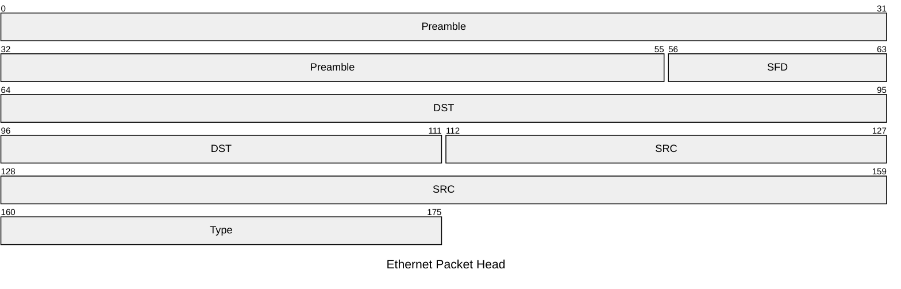

> [!cite]- References  
> [深入理解以太网网线原理 - 嵌入式工程猫的博客](https://blog.vvzero.com/2022/09/18/Ethernet-Wiring/)/[Understanding Ethernet Wiring – Practical Networking .net](https://www.practicalnetworking.net/stand-alone/ethernet-wiring/)
## Ethernet  

链路层传输协议  

规定一组电信号构成一个**数据包**(packet)，叫做**帧**(Frame)，每一帧分成三个部分：**首部**(Head)、**数据**(Data)/**负载**(payload)、尾部    

首部大小固定，最初为18字节，后来增加为22字节，其中首部22字节  

负载最小为46字节，最大为1500字节  
> 1500字节的设计是基于传输距离标准要求下协议使用的时钟同步  
> 同一个信号包的传输时长随传输距离增加而增加，而时钟同步信号必须在固定时隙中发出，为保证时隙固定必须限制 MTU 大小  

### MAC 地址  
以太网通过 MAC 地址唯一标识通信对象  

每块网卡出厂的时候，都有一个全世界独一无二的MAC地址  
长度是48个二进制位，通常用12个十六进制数表示  
其中前6个十六进制数为厂商编号，后6个位该厂商的网卡流水号  

### 以太网广播  

> [!info]- deprecated  
> 老旧的集线器中，以太网协议通过向==本网络内==所有计算机发送数据包，由每台计算机自行判断是否为接收方  
> 每台计算机在收到数据包时，解析数据包的首部中的接收方 MAC 地址，与自身 MAC 地址相比较  

### 以太网帧首部  

**序言**(Preamble)占7个字节，每个字节均为 0xAA(0b10101010)，用于接收方进行时钟复原  
> [!info] 时钟复原 recover the clock  
> 发送方与接收方通常会以预定好的频率发送二进制序列  
> 不同的网卡，发送方和接收方即使预定的频率相同，两者也可能由于物理原因发生偏差  
> 接收方通过序言调整接收频率以与发送方一致  

时钟调整完成后，等待**帧起始信号**(SFD, start frame delimiter)，其值固定为 0xAB  

**目的地**(DST, destination)和**发出地**(SRC, source) 均占6字节  为接收双方的 MAC 地址  

**类型**(Type)占2个字节，说明数据/负载部分的类型，如 0x0800 为 IPv4，0x0806 为 ARP  
