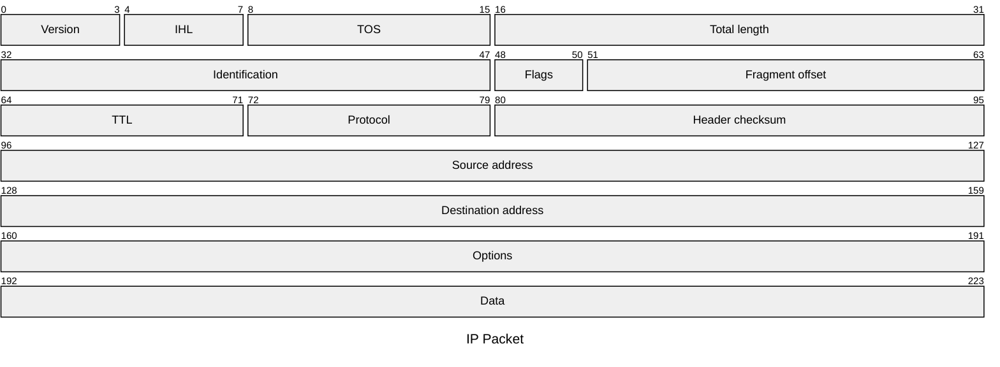

> [!cite]- References  
> [TCP/IP数据包结构详解 - dream_fly_info - 博客园](https://www.cnblogs.com/larry-luo/p/10983633.html)
> [任播研究综述](https://www.jos.org.cn/html/2023/1/6435.htm)  
## IPv4  

```mermaid
---
title: "IP Packet"
---
packet-beta
0-3: "Version"
4-7: "IHL"
8-15: "TOS"
16-31: "Total length"
32-47: "Identification"
48-50: "Flags"
51-63: "Fragment offset"
64-71: "TTL"
72-79: "Protocol"
80-95: "Header checksum"
96-127: "Source address"
128-159: "Destination address"
160-191: "Options"
192-223: "Data"
```
### 子网掩码  