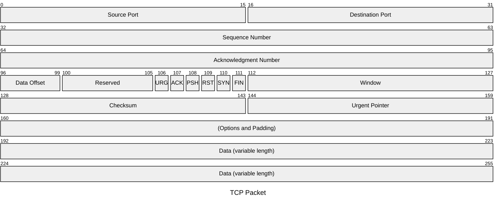

> [!cite]- References  
> [TCP协议详解](https://zhuanlan.zhihu.com/p/64155705)   
## TCP

基于 Ethernet 和 IP 协议的传输层传输协议  
TCP 是[面向连接](#tcp连接)的，即必须先建立 TCP 连接，传输完毕后关闭连接  

TCP 提供[**可靠交付**](#tcp可靠传输)的服务，即保证传输的数据无差错、不丢失、不重复、按序到达  
TCP 提供**全双工通信**  
TCP 面向字节流，即 TCP 不关心上层协议的数据具体内容，仅视作无结构的字节流  

### TCP报文段(Segment)  
TCP 报文段分为 TCP 首部和负载两部分  
TCP 报文段负载大小为$$ IP 数据包负载-TCP 报文段首部$$称之为 MSS(Max Segment Size)，理论最大为1480-20=1460字节  
> 若上层协议的数据包为1500字节，那么就必须分为两个 TCP 报文段发送，HTTP/2 协议对此进行了改进，[压缩 HTTP 头部信息](#首部压缩)使其尽可能在一个 TCP 报文段中
>

首部字段如下：

- **源端口**和**目标端口**各2字节
- **序号**seq 4字节，TCP为每个字节编号，值域$[0,2^{32}-1]$，当序号到达上限后重新从0开始
- **确认号**ack 4字节，期望收到对方下一个报文段的序号
- **偏移** 4位，负载相对于TCP报文段的偏移，等价于TCP首部长度
- **保留** 4位
- 8位**控制位**
  - CWR(Congestion Window Reduced)
  - ECE(ECN-Echo)
  - URG(Urgent)  
    为1时表明紧急指针字段有效  
    告知系统该报文段应尽快传输而非按照排队顺序
  - ACK(Acknowledgment)  
    仅用于建立连接，连接建立后始终为1
  - PSH(PUSH)  
    表明希望键入命令后立即得到响应(Telnet???)
  - RST(RESET)  
    表明TCP连接出现严重错误，必须释放连接再重新建立  
    也用于拒绝非法报文段以及拒绝打开连接
  - SYN(Synchronization)  
    建立连接时用于同步序号
  - FIN(Finish)  
    要求释放连接
- **窗口win** 2字节，接收方让发送方设置发送[窗口](#tcp流量控制)的大小
- **校验和** 2字节，校验范围包括首部和负载  
- **紧急指针** 2字节，仅当URG=1时有效
- **可选项**，长度可变，最大为40字节
- **填充**，长度随可选项而变，保证整个报文段4字节对齐

### TCP连接

每一条TCP连接只能点对点/一对一  
TCP连接的端点称作**套接字/插口**(socket)
> 烂翻译套接字  

RFC793 将其定义为$$socket=[IP地址]:[端口号]$$  
TCP 连接由两个 socket 所确定$$connection=\{socket1,socket2\}$$

建立连接分为两个部分：通知对方自己已经准备就绪 和 确认已接受到对方的通知  

对于握手，双方尚未开始发送数据，因而服务端接收到连接请求后可以立即就绪，对客户端连接请求的确认和就绪通知可以合并为一个报文段，共三次握手  
对于挥手，服务端接收到断开连接请求后可能还有数据需要发送，因而先发送对断开连接请求的确认，待剩余数据发送完毕后再发送断开连接就绪的通知，共四次挥手

#### 建立连接/握手

初始情况下，接收方 TCP 进程已创建**传输控制块**(TCB, Transmission Control Block)并处于 `LISTEN` 状态，即监听

1. 第一次握手  
    SYN=1, seq=x  
    发送方TCP进程创建传输控制块，随机**初始序列号**(ISN, Inital Sequence Number)并发送请求连接报文段，该报文段不可携带数据  
    TCP进程进入`SYN-SENT`状态，即同步已发送  

    > 初始序列号的目的在于防止数据乱序，否则短时间内重新建立连接，先前的报文段若延迟到达会导致混乱  
    > 随机的目的在于防止伪造报文段攻击
2. 第二次握手  
    SYN=1, ACK=1, seq=y, ack=x+1  
    若同意建立连接，同样随机初始化序列号发送确认报文段，该报文段不可携带数据  
    TCP进程进入`SYN-RCVD`状态，即同步已接收  

    此次握手可分为两个报文段，先发送ACK=1, ack=x+1，再发送SYN=1, seq=y  
    此时变为四次握手，等价于三次握手
3. 第三次握手  
    ACK=1, seq=x+1, ack=y+1  
    发送方TCP进程再向接收方TCP进程进行确认，该报文段可以携带数据，若不携带则下一个序号seq仍为x+1  
    TCP进程进入`ESTABLISHED`状态  
    接收方接收到报文段后同样进入`ESTABLISHED`状态  
    > 最后的确认报文段用于防止已失效的连接请求报文段延迟到达而产生错误
    >
#### 释放连接/挥手

4. 第一次挥手  
  FIN=1, seq=u  
  其中u=已发送的最后一个字节序号+1  
  发送方发送连接释放报文段，停止发送数据，主动关闭TCP连接  
  TCP进程进入`FIN-WAIT-1`状态，即终止等待1  
5. 第二次挥手  
  ACK=1, seq=v, ack=u+1  
  其中v=已发送的最后一个字节序号+1  
  从发送方到接收方的连接已释放，但发送方仍需接收从接收方的数据，TCP进程此时应通知上层协议进程
  接收方TCP进程进入`CLOSE-WAIT`状态  
  发送方TCP进程收到确认后进入`FIN-WAIT-2`状态
6. 第三次挥手  
  FIN=1, ACK=1, seq=w, ack=u+1  
  当接收方已发送完所有数据后，发送连接释放报文段  
  TCP进程进入`LAST-ACK`状态  
7. 第四次挥手  
  ACK=1, seq=u+1, ack=w+1  
  TCP进程进入`TIME-WAIT`状态，在等待2MSL(Maximum Segment Lifetime)后，进入`CLOSED`状态  
  接收方收到报文段后进入`CLOSED`状态

    > 若最后一个确认报文段超时或丢失，B会重传FIN+ACK报文段，A接收后会重传确认报文段并重新等待2MSL  
    > 等待2MSL用于防止已失效的报文段延迟到达而产生错误，2MSL之后该次连接的所有报文段都将从网络消失
    >

### TCP可靠传输

理想的可靠传输需要以下两点  

8. 传输信道不产生差错  
  [确认和超时重传](#确认和超时重传)  
9. 接收方总是来得及处理收到的数据  
  [TCP流量控制](#tcp流量控制)  

#### 确认和超时重传  

确认即接收到报文段后，返回一个确认应答消息  
超时重传即未发送的分组设置计时器，超过指定时间没有收到确认即视作发送的报文段已丢失并重新发送

##### 超时重传时间  

TCP记录一个报文段发出的时间以及收到确认的时间，两者之差即为往返时间$RTT$(Round-Trip Time)  

计算加权平均往返时间$RTTs$，其中$α∈[0, 1)$，推荐值为0.125  
$$new\_RTTs=(1-α)·old\_RTTs+α·new\_RTT$$

计算偏差加权平均值$RTTD$，其中$β∈[0, 1)$，推荐值为0.25  
$$new\_RTTD=(1-β)·old\_RTTD+β·|RTTs-new\_RTT|$$

计算超时重传时间$RTO$(Retransmission Timeout)  
$$RTO=RTTs+4·RTTD$$

##### 停止ARQ(Automatic Repear reQuest, ARQ)协议

每发送一个报文段均需要等待对方的确认  
为每一个发送的分组设置超时计时器，一定时间内没有收到确认即视作发送的报文段已丢失并重新发送

##### 连续ARQ协议

利用了滑动窗口协议的思想

- 流水线传输  
  等待ARQ协议信道利用率低，为提高传输效率，可以使用流水线传输，即连续发送多个分组，而非每发送一个就等待对方确认  

- 累计确认  
  即收到n个分组后，对按序到达的最后一个分组发送确认  

  累计确认问题在于无法反映已经接收到的所有分组信息，连续的n个分组，若丢失中间的某个分组，发送方无法得知其之后的分组是否已正常到达

##### 选择性确认(Selective Acknowledgment)

在TCP首部可选项字段增加SACK数据，将丢失的中间分组信息发送给发送方  
SACK必须TCP通信双方均支持

##### 重复选择性确认(Duplicate Selective Acknowledgment)

用于通知发送方哪些数据被重复接收了
NFY

#### TCP流量控制

TCP流量控制利用了**以字节为单位**的滑动窗口  

分为发送窗口和接收窗口  

- 发送窗口  
  发送方依据收到的确认报文段和[拥塞窗口](#tcp-拥塞控制)构造窗口，窗口为$[ack, ack+min(win, cwnd))$  
  在没有收到确认的情况下，发送方可以将窗口内的数据连续发送出去，且在收到确认前必须保留用于重传  

  发送窗口维护三个指针p1,p2,p3，其中$[p1, p2)$为已发送但未收到确认的数据，$[p2, p3)$为可以发送但未发送的数据，$[p1, p3)$即为当前发送窗口  

  当p2与p3重合时，发送方停止发送，若一段时间后仍未收到确认则重传
- 接收窗口  
  接收方仅对**按序收到**的数据的最高序号给出确认  
  当窗口左端开始的连续个数据收到后，窗口相应整体右移

- 避免死锁  
  TCP为每一个连接设置一个**持续计时器**(persistence timer)，当收到通信另一方的零窗口通知时即启动，当到期时发送一个零窗口探测报文段，若确认报文段中窗口仍为0，则重置计时器；否则继续通信

### TCP 缓存与传输

TCP维持发送缓存和接收缓存  

- 发送缓存  
  包含已发送并确认的数据，发送窗口和未发送但超出发送窗口大小的数据  
- 接收缓存  
  包含已接收并确认的数据，接收窗口和未收到但超出接收窗口大小的数据

当缓存中数据达到MSS时或上层协议指定PSH操作位或计时器超时，立即将未发送的部分组装成报文段发送出去

#### 糊涂窗口综合征

TCP接收方的接收窗口仅剩很少字节数可用，且这种状态将持续一段时间，导致网络的效率很低  

解决方案是接收方等待直至缓存空间足够时再发送确认报文段向发送方更新窗口大小信息  

### TCP 拥塞控制

- 拥塞  
  在计算机网络中的链路容量(即宽带)、交换结点中的缓存和处理机等，都是网络资源。在某段时间，若对网络中某一资源的需求超过了该资源所能提供的可用部分，网络的性能就要变差

拥塞控制目的是防止过多的数据注入到网络中导致拥塞

cwnd: 当前窗口大小  
ssthresh: 慢启动上限，通常为65536  
传输轮次: 拥塞窗口所允许的报文段均发送出去且都收到了确认

- 慢开始(slow start)
  cwnd初始值为MSS，每经过一个传输轮次即加倍，呈指数增长  
  当达到ssthresh时，使用拥塞避免

- 拥塞避免(congestion avoidance)
  cwnd每经过一个传输轮次加1  

- 快重传(fast retransmit)
  由于累计确认机制，当丢失某个中间的报文段时，仅会确认最后一个按序到达的报文段，当连续收到3个相同的确认报文段时，发送方即会在计时器超时之前，立即重传

- 快恢复(fast recovery)
  ssthresh减半
  cwnd设置为ssthresh当前值，并执行拥塞避免

拥塞窗口首先位于慢开始阶段，若达到ssthresh则进入拥塞避免  
当发生拥塞时，若未触发快重传(网络超时)时，则将ssthresh减半，并将cwnd置1  
若触发快重传，则在快重传之后进入快恢复
